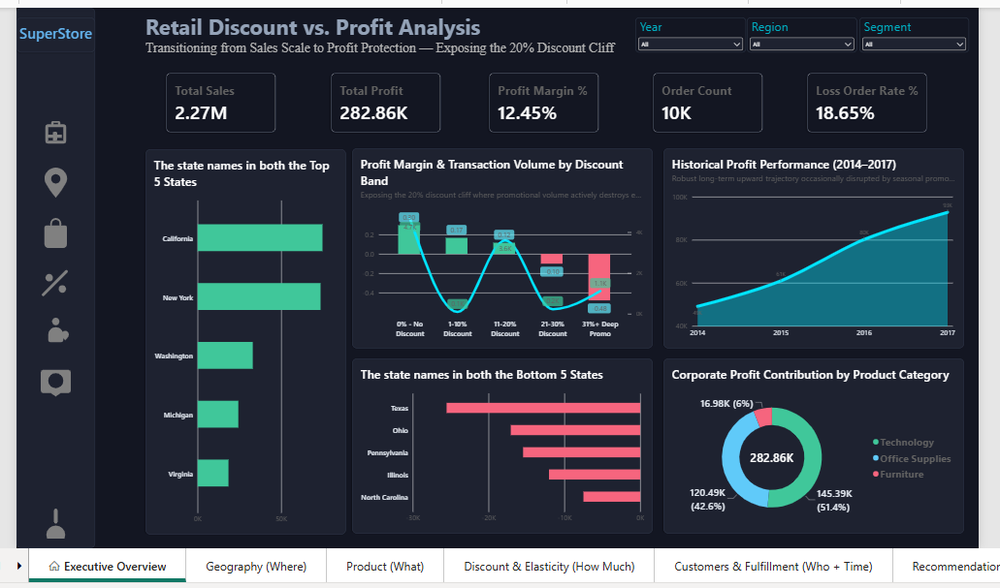

# 📊 Superstore Discount & Profit Analysis

<p align="center">
  
</p>

<p align="center">
  <strong>An end-to-end data analytics project exploring how discount strategies impact sales, profit, customer performance, product profitability, and regional business performance.</strong>
</p>

<p align="center">

  

  

  

  

</p>

---

# 📌 Table of Contents

- [Project Overview](#-project-overview)
- [Business Problem](#-business-problem)
- [Project Objectives](#-project-objectives)
- [Business Questions](#-business-questions)
- [Tools & Technologies](#-tools--technologies)
- [Project Workflow](#-project-workflow)
- [Repository Structure](#-repository-structure)
- [Data Preparation](#-data-preparation)
- [SQL Analysis](#-sql-analysis)
- [Python Analysis](#-python-analysis)
- [Power BI Dashboard](#-power-bi-dashboard)
- [Dashboard Insights](#-dashboard-insights)
- [Business Recommendations](#-business-recommendations)
- [Key Business Value](#-key-business-value)
- [Future Improvements](#-future-improvements)
- [Author](#-author)

---

# 🔍 Project Overview

Discounts are one of the most common strategies used by retail businesses to attract customers and increase sales. However, increasing discounts does not always lead to increased profitability.

This project analyzes the relationship between:

- 💰 Sales
- 📉 Discounts
- 📈 Profit
- 👥 Customers
- 📦 Products
- 🗺️ Geographic regions

The objective is to understand whether discounting is contributing to profitable growth or creating **profit leakage**.

The project follows an end-to-end data analytics workflow using **SQL, Python, and Power BI** to transform raw Superstore transaction data into actionable business insights.

---

# 🎯 Business Problem

The company needs to understand:

> **How can discounts be used to increase sales without negatively affecting profitability?**

Excessive discounting may increase order volume while simultaneously reducing profit margins.

This analysis investigates:

- Which discount levels are profitable
- Where profit losses occur
- Which products are vulnerable to excessive discounting
- Which customers contribute to profit leakage
- Which regions require business attention
- How the company can improve its discount strategy

---

# 🎯 Project Objectives

The main objectives of this project are:

1. Analyze the relationship between discounts and profit.
2. Identify potentially unprofitable discount ranges.
3. Analyze sales and profit performance across geographic regions.
4. Identify profitable and loss-making product categories.
5. Analyze customer-level profitability.
6. Explore customer behavior using analytical techniques.
7. Identify areas of potential profit leakage.
8. Build an interactive Power BI dashboard.
9. Provide data-driven business recommendations.

---

# ❓ Business Questions

This project aims to answer the following questions:

### 💸 Discount Analysis

- How do different discount levels affect profitability?
- Are higher discounts associated with lower profits?
- Which discount ranges require closer business monitoring?

### 🗺️ Geographic Analysis

- Which regions generate the highest sales?
- Which states contribute significantly to losses?
- Where should discount and pricing strategies be reviewed?

### 📦 Product Analysis

- Which product categories generate the highest sales?
- Which products generate strong profits?
- Which products or categories experience losses?

### 👥 Customer Analysis

- Which customers generate the highest profit?
- Which customers contribute to profit leakage?
- How can customers be segmented based on purchasing behavior?

### 📊 Business Strategy

- How can the company reduce losses?
- Where should discount controls be introduced?
- How can product and customer data improve decision-making?

---

# 🛠️ Tools & Technologies

| Tool / Technology | Purpose |
|---|---|
| 🗄️ **MySQL** | Data querying and business analysis |
| 🐍 **Python** | Data analysis and advanced analytics |
| 🐼 **Pandas** | Data cleaning and manipulation |
| 📊 **Matplotlib / Seaborn** | Data visualization |
| 📈 **Power BI** | Interactive dashboard development |
| 📓 **Jupyter Notebook** | Exploratory data analysis |
| 🐙 **GitHub** | Project documentation and version control |

---

# 🔄 Project Workflow

```text
                    ┌─────────────────────┐
                    │   Raw Data Source   │
                    └──────────┬──────────┘
                               │
                               ▼
                    ┌─────────────────────┐
                    │ Data Preparation &  │
                    │      Cleaning       │
                    └──────────┬──────────┘
                               │
              ┌────────────────┼────────────────┐
              ▼                ▼                ▼
       ┌─────────────┐   ┌─────────────┐  ┌─────────────┐
       │     SQL     │   │   Python    │  │  Power BI   │
       │  Analysis   │   │  Analysis   │  │ Visualization│
       └──────┬──────┘   └──────┬──────┘  └──────┬──────┘
              │                │                │
              └────────────────┼────────────────┘
                               │
                               ▼
                    ┌─────────────────────┐
                    │ Business Insights & │
                    │ Recommendations     │
                    └─────────────────────┘
